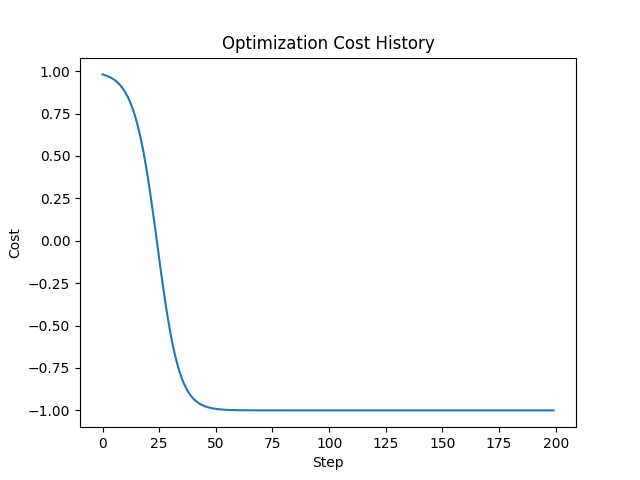

# Quantum VQE Optimization Project

## Overview
This project focuses on optimizing Variational Quantum Eigensolver (VQE) circuits using gradient descent and parallel processing. It includes hyperparameter optimization through random search to identify the best parameters for the VQE circuits.

## Best Parameters
The best parameters identified through random search are:
- **Steps**: 200
- **Stepsize**: 0.1
- **Circuit**: default

## Results
The optimization process converged successfully, achieving a minimum cost value. The final report and graphs are saved in the `results` directory.

## Graphs and Visualizations
- 
- 
- 
- 
- 

## Process Description
1. **Parameter Initialization**: The initial parameters were randomly initialized.
2. **Optimization**: The optimization process was performed using a gradient descent optimizer.
3. **Parallel Processing**: The optimization and analysis were done in parallel to improve performance.
4. **Analysis**: The results were analyzed using various statistical metrics and visualizations.
5. **Hyperparameter Search**: A random search was conducted to find the best hyperparameters.

## How to Run
1. **Clone the repository**:
    ```bash
    git clone https://github.com/dkrizhanovskyi/quantum-vqe-project.git
    cd quantum-vqe-project
    ```

2. **Install dependencies**:
    ```bash
    pip install -r requirements.txt
    ```

3. **Run the random search for hyperparameter optimization**:
    ```bash
    python random_search.py --config config.yaml
    ```

4. **Run the optimization with the best parameters**:
    ```bash
    python run_optimization.py --config config.yaml
    ```

## Configuration
The `config.yaml` file contains the configuration parameters for the optimization process. Update the parameters as needed.

### Example `config.yaml`
```yaml
optimization:
  steps: 200  # Best number of steps
  stepsize: 0.1  # Best step size
  circuit: default  # Best circuit type
  save_path: results/state.json
  load_path: ''
results_dir: results
parallel_processes: 4  # Number of parallel processes
 ```
